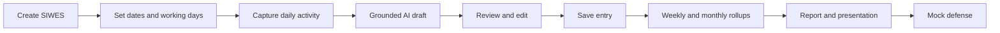

# 01. Product requirements document

## Purpose

Define what SIWES Companion must do, for whom, and how success is measured. This document is the product boundary used by design, engineering and QA.

## Scope

The product supports one student account with one or more historical SIWES programmes, although only one programme is active for the Milestone 01 experience. It documents authentic work, compiles reviewed records, and prepares the student to explain that work.

## Vision

Help Nigerian students turn real daily SIWES work into a reliable record they can understand and defend.

## Problem

Students often delay logbook writing, lose context between workdays, and struggle to transform messy notes into formal entries. By report and defense time, the record is incomplete and the student cannot confidently explain the tools, decisions or limits of their experience.

## Product principles

1. AI organizes the student's real experience. It never manufactures experience.
2. Raw input, generated output and student-edited output are all retained.
3. The student reviews and owns every saved result.
4. The shortest useful interaction is preferred, especially on a phone or Telegram.
5. The product must remain useful when the LLM, network or email provider is unavailable.

## Personas

| Persona | Need | Product response |
| --- | --- | --- |
| Student | Capture messy work quickly, remember progress, write a report and prepare for defense without inventing claims. | Daily assisted capture, editable history, evidence, grounded summaries and practice questions. |
| Industry-Based Supervisor (IBS) | See what the student recorded and sign/comment using the institution's normal process. | Exportable weekly pages with comment/signature spaces; optional future portal. |
| Institution-Based Supervisor (ISS) | Assess progress and report completeness. | Institution-configurable exports and future review portal; no supervisor account required for MVP. |
| Institution coordinator | Need consistent templates and fewer incomplete submissions. | Configurable report/logbook layouts and aggregate features later. |

## Core journey

## User stories and acceptance criteria

### Programme setup

**US-01** As a student, I can create a SIWES programme with duration, institution, placement, supervisors and dates.

Acceptance criteria:

- Duration is 3 or 6 months in the initial UI and remains configurable in the domain.
- Start date is before or equal to end date.
- The system calculates the programme timezone and working-day policy.
- A programme cannot be created without an authenticated owner.
- A second active programme is blocked unless the existing one is ended or archived.

### Daily loop

**US-02** As a student, I can write what I did in natural language for a working day.

**US-03** As a student, I receive a formal draft grounded only in what I wrote.

**US-04** As a student, I can edit, regenerate, save, or leave a draft unfinished.

Acceptance criteria:

- One saved entry exists per programme/date; repeated save is idempotent.
- Raw text is retained unchanged after generation.
- Generated content includes explicit uncertainty or a clarifying question when the source is thin.
- The UI distinguishes AI-generated text from student-edited text.
- A user can edit a saved entry without losing the prior generated version.
- If the LLM is unavailable, the raw note can still be saved as an unprocessed draft.

### History and rollups

**US-05** As a student, I can see this week’s entries and missing working days.

**US-06** As a student, I can edit weekly and monthly summaries before export.

Acceptance criteria:

- History is scoped to the authenticated owner.
- Week and month groupings respect the programme timezone and working-day policy.
- Missing dates are visible without creating empty fake entries.
- Rollups cite the entries used to generate them.

### Evidence and outputs

**US-07** As a student, I can attach evidence to an entry or project.

**US-08** As a student, I can compile and edit a final report and presentation from reviewed records.

Acceptance criteria:

- Uploads are private and served via expiring signed URLs.
- Unsupported or oversized files are rejected before persistence.
- Generated report sections show provenance links back to source entries.
- Export layouts are selected by institution/template, not assumed globally.

### Telegram

**US-09** As a student, I can link Telegram to the same account and log from the bot.

Acceptance criteria:

- Link tokens expire, are single-use and cannot attach one Telegram identity to two users.
- Bot and web read/write the same programme and entries.
- Drafts can be resumed across channels.
- Duplicate Telegram updates do not duplicate entries or jobs.

### Defense

**US-10** As a student, I can practice questions generated from my reviewed experience.

Acceptance criteria:

- Defense remains locked until the configured final-phase window.
- Questions are grounded in documented records and clearly identify unsupported areas.
- Mock defense feedback is qualitative and actionable; it does not invent a numeric score.

## Scope by release

| Release | Included |
| --- | --- |
| Milestone 01 | Sign-in shell, create SIWES, current-day capture, grounded generation, review/edit/save, weekly history, resilient drafts, core tests. |
| MVP | Programme settings, working-day overrides, Telegram account linking and daily loop, evidence metadata/uploads, weekly and monthly summaries, basic exports, audit/provenance. |
| V1 | Final report builder, configurable report/logbook templates, presentation and speaker notes, Defense Center, mock defense, reminder scheduling, full operational hardening. |
| Later | WhatsApp adapter, supervisor sign-off portal, institution dashboards, multilingual/Pidgin input, offline-first mobile app, local payments and monetization. |

## Explicit non-goals

- Generating activities, tools, achievements, responsibilities or outcomes the student did not document.
- Automatically signing a supervisor’s name or producing a fake signature.
- Replacing institutional assessment or claiming compliance with every university’s SIWES rules.
- Building a full social network, job board, or employer CRM.
- Storing confidential company data without warning, minimization and deletion controls.

## Success metrics

| Metric | Initial target | Measurement |
| --- | --- | --- |
| First-entry activation | 60% of new programmes save a first reviewed entry within 24 hours | Programme and entry events |
| Week-one continuity | 40% record at least 4 configured working days in first 7 days | Working-day-aware streak |
| Review behavior | 70% of generated entries are opened and either edited or explicitly confirmed | Provenance events |
| Report readiness | 60% of active final-month students start a report before the final 2 weeks | Phase and report events |
| Defense usefulness | 70% of surveyed students say questions reflect their own experience | Post-practice survey, not an inferred score |
| Reliability | 99.5% successful daily save requests excluding provider outages | API metrics |

## Assumptions

- Students have intermittent mobile connectivity and may switch between web and Telegram.
- Programme dates and working days are more reliable than generic calendar assumptions.
- A student can correct AI output; downstream artifacts use the corrected version.
- An institution may require a custom structure, so report sections and export templates are data-driven.

## Risks

| Risk | Impact | Mitigation |
| --- | --- | --- |
| AI embellishes work | Academic integrity and trust damage | Grounded prompts, structured evidence, refusal/clarification, provenance UI, adversarial tests. |
| Students paste confidential company data | Privacy and employer risk | Warnings, minimization, redaction guidance, retention/deletion controls, provider contract review. |
| Telegram account takeover | Cross-channel data exposure | Single-use link tokens, explicit confirmation, unlink/recovery flow, webhook verification. |
| Slow LLM calls on serverless host | Poor daily experience | Queue long work, timeout budgets, fallback raw save, provider abstraction. |
| Institution layouts vary | Unusable exports | Template registry and a supplied sample per institution. |

## Design concerns

The product should not position AI generation as the required first step. Saving the student's raw note must always work, because network and provider failure should not make the logbook feel lost. Generation is assistance, not the persistence boundary.

## Open questions

- Which two institutions are the first template pilots?
- Is the first production audience a closed cohort or public sign-up?
- Is a supervisor portal in V1 or only export-based handoff?
- Which local payment provider, if any, is acceptable for future plans?

## Cross-references

See [02-ux-information-architecture.md](./02-ux-information-architecture.md) for interaction states, [06-ai-llm-design.md](./06-ai-llm-design.md) for grounding rules, and [18-implementation-roadmap.md](./18-implementation-roadmap.md) for delivery order.
