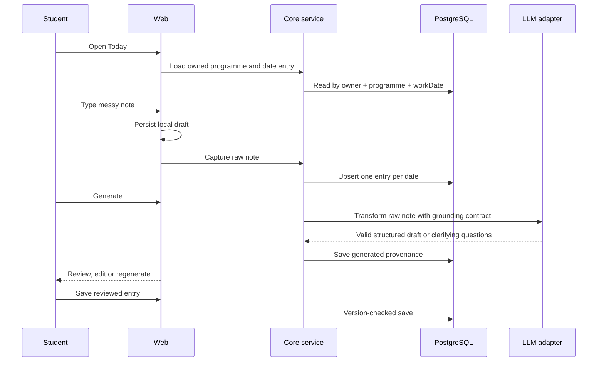
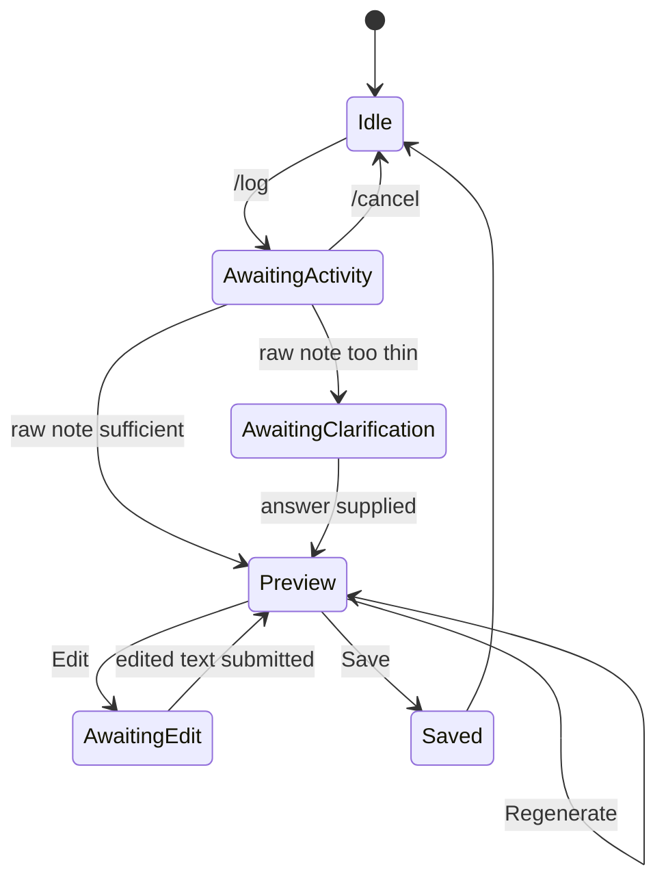

# 02. UX and information architecture

## Purpose

Define the mobile-first web and Telegram experiences, including every meaningful state and the point at which each phase becomes visible.

## Scope

Milestone 01 is optimized for the daily loop. The rest of the information architecture reserves stable routes for summaries, evidence, report compilation and defense without making locked features look broken.

## Decisions

- The dashboard is a calm work queue, not an analytics wall. The next useful action is always prominent.
- Raw notes autosave locally before network submission. The server never treats local draft state as a saved entry until the student confirms.
- Web uses long-form editing and exports; Telegram uses short capture, status, evidence and practice flows.
- Phase changes are date-driven and explainable: Document during the programme, Compile in the final month or after end date, Defend in the final two weeks. Institution overrides are supported later.

## Sitemap

```text
/                         Landing / sign in
/dashboard                Current programme, phase and next action
/dashboard/setup          Create or edit programme
/dashboard/today         Capture and review today's entry
/dashboard/history       Week/month history and missing working days
/dashboard/skills        Skills, tools, projects and evidence timeline
/dashboard/report        Report builder (locked until Compile)
/dashboard/presentation  Slides and speaker notes (locked until Defend)
/dashboard/defense       Questions and mock defense (locked until Defend)
/settings                 Account, timezone, working days, Telegram link
/api/*                    Authenticated route handlers for adapters
```

## Screen inventory

| Screen | Primary action | Important states |
| --- | --- | --- |
| Sign in | Continue with Google or email link | idle, sending, expired link, unavailable email |
| Programme setup | Save programme | validation, duplicate active programme, offline draft |
| Dashboard | Open next action | no programme, active, completed, compile, defend |
| Today | Write note / generate / save | empty, autosaving, generating, clarification, generated, conflict, offline |
| History | Select week/date | empty week, missing workday, loading, edit conflict |
| Timeline | Filter by skill/tool/project/evidence | empty filters, pagination, deleted evidence |
| Report | Edit section / export | locked, generating, source list, export failure |
| Defense | Start session / answer | locked, waiting, follow-up, provider outage, feedback |
| Settings | Change calendar/link account | confirmation, invalid timezone, Telegram already linked |

## Daily loop



## ASCII wireframes

### Dashboard

```text
┌────────────────────────────────────────────┐
│ SIWES Companion                 Menu  •••   │
│ Good evening, Ada                          │
│ Software Engineering SIWES                 │
│ Day 18 of 62       29% complete             │
│ [ Continue today's entry ]                  │
├────────────────────────────────────────────┤
│ This week                                  │
│ ● Mon  ● Tue  ○ Wed  ○ Thu  ○ Fri           │
│ 2 entries saved · 3 working days remaining  │
├────────────────────────────────────────────┤
│ Document                                    │
│ Build the record while the work is fresh.   │
│                                             │
│ Compile (locked)        Defend (locked)     │
└────────────────────────────────────────────┘
```

### Today

```text
┌────────────────────────────────────────────┐
│ ← Today · Wed, 21 Sep                      │
│ What did you work on?                      │
│ ┌────────────────────────────────────────┐ │
│ │ I watched my supervisor configure...   │ │
│ └────────────────────────────────────────┘ │
│ Saved on this device                       │
│ [ Generate grounded draft ]                │
├────────────────────────────────────────────┤
│ Draft                                      │
│ AI output is a suggestion. Review it.      │
│ [generated entry text]                     │
│ [ Edit ] [ Save entry ] [ Regenerate ]     │
└────────────────────────────────────────────┘
```

## Copy and tone

- Say “Tell us what happened” rather than “Submit a report”.
- Explain missing information without blame: “I need one detail to keep this accurate.”
- Label AI content as “AI draft” and student content as “Your note”.
- Never say “we know you configured…” when the source only says “you watched”.
- Offline copy: “Saved on this device. We’ll sync when you reconnect.”

## Accessibility

- Use semantic headings, labelled form controls, visible focus rings and keyboard-reachable actions.
- Do not encode status by color alone; use text and icons with accessible labels.
- Maintain 4.5:1 text contrast, 3:1 large-text/UI contrast, 44px minimum touch targets.
- Announce generation state through an `aria-live="polite"` region.
- Respect reduced motion and use plain-language error messages.

## Low-bandwidth and offline behavior

- Server-render dashboard and history; lazy-load editor/export bundles.
- Store only current raw draft and pending mutation in IndexedDB/localStorage, capped at 20 entries.
- Retry idempotent saves with exponential backoff; never auto-retry a generation that may incur LLM cost without explicit user intent.
- Compress evidence previews client-side and upload original files directly to signed storage URLs.

## Telegram equivalents



Telegram uses one question per message, inline Save/Edit/Regenerate buttons, a web deep link for long editing, and the same server draft record used by web.

## Design concerns

Locking features by a single absolute date can confuse students whose institution has a different presentation schedule. The initial rule is explainable and configurable; a future programme setting should allow the student to confirm the actual presentation date.

## Open questions

- Should the initial web app support local email magic-link delivery or only Google in the first closed cohort?
- What institution-specific supervisor fields must appear in the first export template?

## Cross-references

See [01-prd.md](./01-prd.md), [07-telegram-bot-design.md](./07-telegram-bot-design.md), [09-frontend-implementation-guide.md](./09-frontend-implementation-guide.md), and [12-defense-center-design.md](./12-defense-center-design.md).
