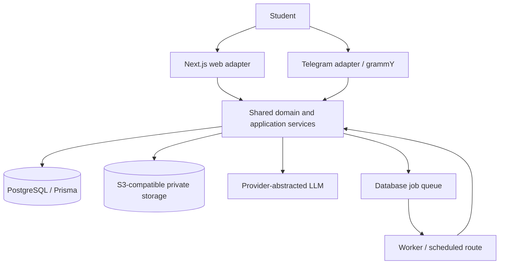
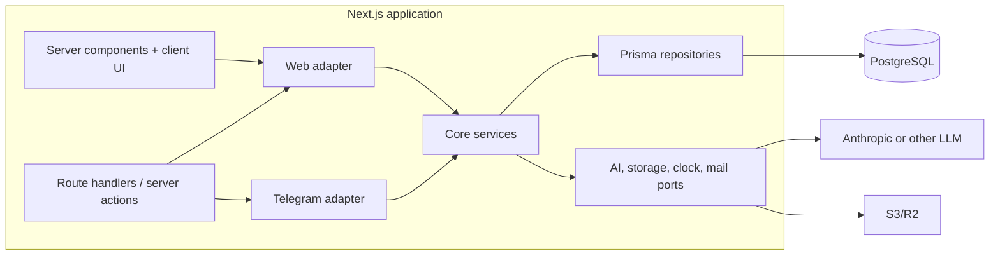
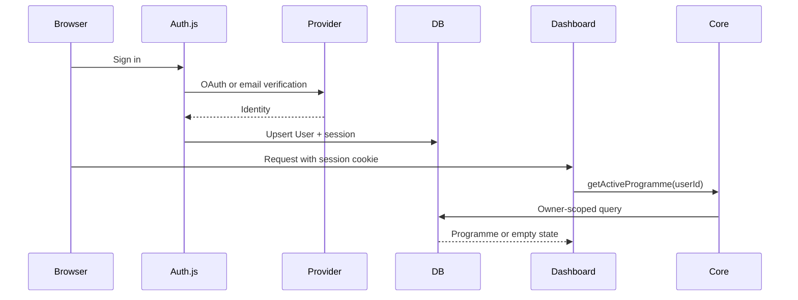
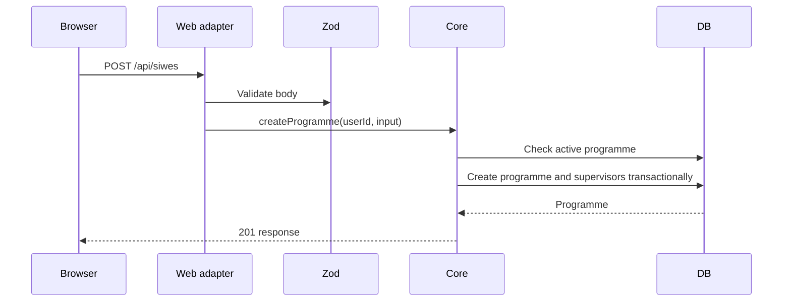
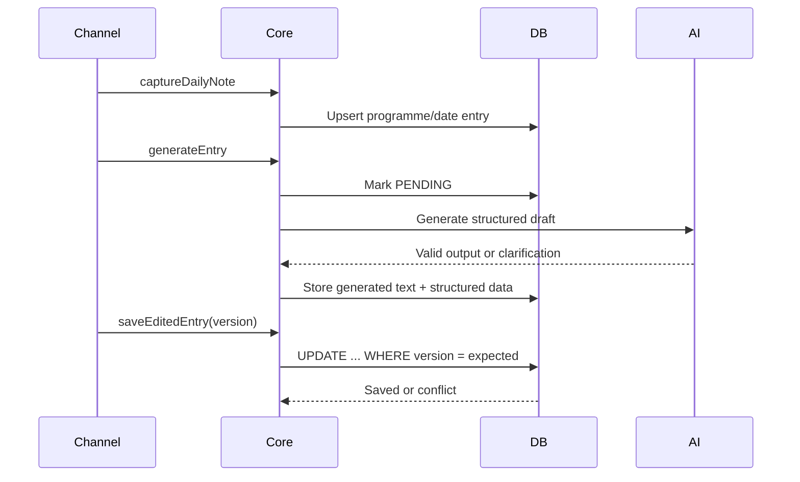
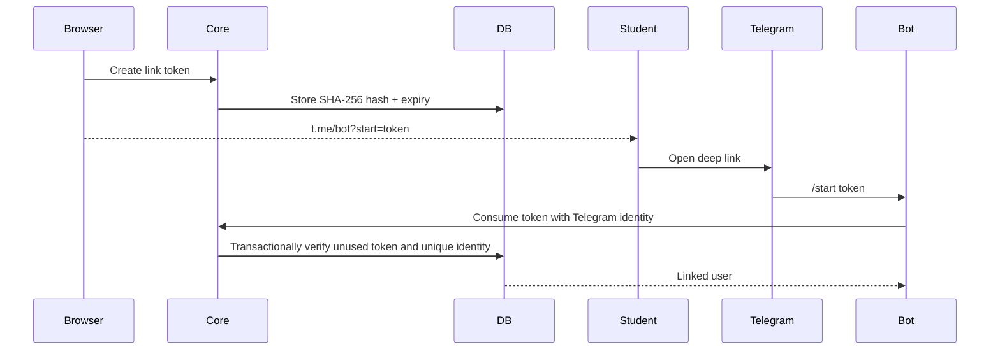
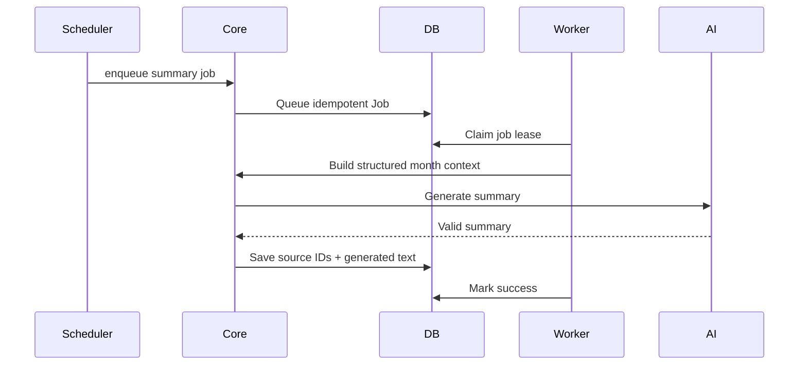
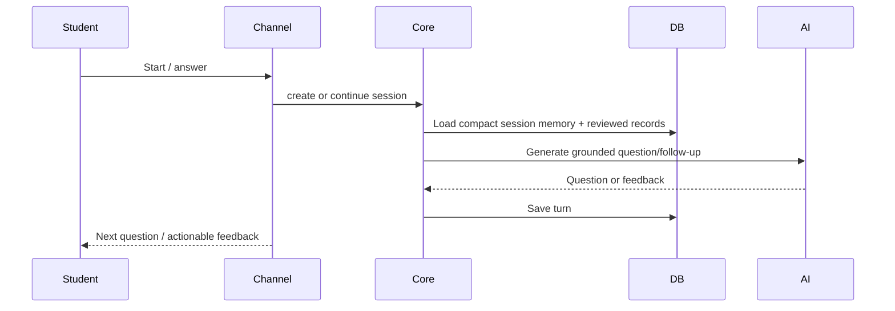

# 03. System architecture

## Purpose

Describe the deployable services, module boundaries, channel adapter contract, critical sequences and failure behavior.

## Scope

The architecture covers the web app, Telegram webhook, PostgreSQL, object storage, LLM providers, scheduled jobs and exports. It does not require a second microservice for Milestone 01.

## Decisions

- One Next.js application owns web pages and authenticated route handlers.
- Core services are pure TypeScript modules behind repository/provider ports.
- grammY runs in the Telegram route handler and calls core services through `src/adapters/telegram`.
- PostgreSQL jobs are claimed by a worker endpoint/process; serverless requests enqueue rather than wait on long work.
- LLM calls are provider-abstracted and schema-validated at the boundary.

## Context diagram



## Container diagram



## Component boundaries

| Module | Owns | Must not own |
| --- | --- | --- |
| `src/core/siwes` | Programme validation, active programme policy, calendar inputs | HTTP, Telegram formatting |
| `src/core/entries` | Capture, generation state, optimistic versioning, entry provenance | Prisma query syntax, Telegram messages |
| `src/core/ai` | Prompt contracts, output validation, provider calls, redaction policy | User authorization and persistence |
| `src/core/telegram` | Link-token policy and channel-neutral conversation state | grammY update parsing |
| `src/core/jobs` | Queue lifecycle, retry/backoff and idempotency | Hosting scheduler implementation |
| `src/adapters/web` | Authenticated request parsing and response mapping | Business decisions |
| `src/adapters/telegram` | Update parsing, keyboard rendering and message chunking | Direct database writes |
| `src/lib` | Prisma client, env parsing, logging | Product policy |

## Critical sequences

### Sign-in and programme load



### Create programme



### Generate and save entry



### Telegram linking



### Monthly summary and report



### Mock defense turn



## Deployment topology

```text
Browser / Telegram -> HTTPS -> Vercel Next.js
                               |-> Neon/Supabase Postgres
                               |-> Cloudflare R2
                               |-> Anthropic API
                               `-> scheduled worker route or small VPS worker
```

Vercel function timeouts and cold starts mean daily generation should have a short timeout and a raw-save fallback. Exports and large reports are jobs. A private VPS deployment is documented separately in `private-vps-deployment.md`.

## Environments

| Environment | Database | Storage | Provider behavior |
| --- | --- | --- | --- |
| Local | Docker PostgreSQL | local adapter or MinIO | fake generator unless API key is intentionally set |
| Staging | isolated managed PostgreSQL | isolated bucket | real provider with low quotas and redacted logs |
| Production | managed PostgreSQL with backups | private bucket with lifecycle rules | configured models, limits and alerts |

## Failure modes

- Database unavailable: show retryable error; retain local draft; do not claim a save.
- LLM timeout/invalid JSON: mark generation failed, keep raw note, offer retry and edit manually.
- Telegram duplicate update: ignore already-recorded `update_id`.
- Concurrent edit: return 409 with latest version and let the student choose merge/overwrite.
- Storage failure: persist evidence metadata as pending only if upload can resume; never expose an unverified URL.
- Job lease timeout: reclaim after lease interval; idempotency key prevents duplicate outputs.

## Open questions

- Should the production worker be a small always-on VPS process or a provider-native scheduled function?
- Which email provider meets the first cohort's delivery and cost needs?

## Cross-references

See [04-database-design.md](./04-database-design.md), [05-api-specification.md](./05-api-specification.md), [10-backend-implementation-guide.md](./10-backend-implementation-guide.md), and [13-infrastructure-devops-and-deployment.md](./13-infrastructure-devops-and-deployment.md).
