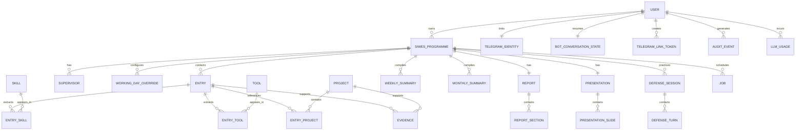

# 04. Database design

## Purpose

Define PostgreSQL persistence, constraints, provenance, ownership and retention. The executable schema is [`../prisma/schema.prisma`](../prisma/schema.prisma).

## Scope

The schema covers Auth.js, programmes, calendars, daily entries, extractions, evidence, rollups, reports, presentations, defense, Telegram, jobs, audits and LLM usage.

## Decisions

- PostgreSQL is required in every deployed environment. Prisma is the access layer.
- IDs are opaque CUIDs except externally supplied Telegram update/user IDs, stored as strings to avoid integer overflow assumptions.
- Programme ownership is the authorization root. Every read/write repository method takes `userId` and `programmeId` or `entryId` and verifies ownership.
- Entries retain `rawText`, `generatedText`, `editedText`, `structuredData`, generation status and version.
- User deletion is soft at the user row until asynchronous dependent-data deletion succeeds; operationally deleted content is hard-deleted or cryptographically rendered inaccessible according to the retention job.

## ERD



## Table contract

| Table | Important fields and constraints |
| --- | --- |
| `User` | Auth identity, timezone, soft-delete marker. `email` unique when present. |
| `SiwesProgramme` | Owner, dates, duration, placement details, timezone, status. Active programme indexed by owner. |
| `WorkingDayOverride` | `programmeId + date` unique; explicit WORKING/NON_WORKING overrides weekday defaults. |
| `Entry` | `programmeId + workDate` unique; raw/generated/edited text; structured JSON; version for optimistic concurrency. |
| `Skill`, `Tool`, `Project` | Programme-scoped names unique within a programme. |
| `EntrySkill`, `EntryTool`, `EntryProject` | Composite keys prevent duplicate extraction links. |
| `Evidence` | Private file/url/note metadata with status and optional entry/project parent. |
| `WeeklySummary`, `MonthlySummary` | Unique programme period, generated/edited content and JSON source ID list. |
| `Report`, `ReportSection` | One report per programme; section key and position unique. |
| `Presentation`, `PresentationSlide` | One presentation per programme; ordered slides. |
| `DefenseSession`, `DefenseTurn` | Ordered practice conversation with qualitative feedback JSON. |
| `TelegramIdentity` | One Telegram user to one SIWES user and vice versa via unique keys. |
| `TelegramLinkToken` | Hashed, expiring, single-use token. Plain token never stored. |
| `BotConversationState` | One resumable state per linked user/chat; payload is channel state only. |
| `TelegramUpdate` | Unique update ID for idempotent webhook handling. |
| `Job` | Leaseable durable work with attempts, run-after and idempotent payload. |
| `AuditEvent` | Security/product provenance without raw PII in metadata. |
| `LlmUsage` | Provider/model/purpose/token counts/cost estimate; no prompt or raw entry body. |

## Date and timezone rules

- Store date-only fields as PostgreSQL `DATE`; store event timestamps as UTC `TIMESTAMP` values.
- “Today” is the current date in the programme timezone, default `Africa/Lagos`, not the server’s UTC date.
- A student can backfill a date only inside programme bounds unless an explicit admin/import path is added.
- Working-day calculations use weekday defaults plus overrides. No empty Entry is created for a missed day.

## Representative queries

```ts
const weekEntries = await prisma.entry.findMany({
  where: {
    programme: { userId, id: programmeId },
    workDate: { gte: weekStart, lte: weekEnd },
    status: { not: "ARCHIVED" }
  },
  orderBy: { workDate: "asc" }
});
```

```ts
const activeProgramme = await prisma.siwesProgramme.findFirst({
  where: { userId, status: "ACTIVE" },
  include: { entries: { where: { status: "SAVED" }, select: { workDate: true } } }
});
```

## Migration and seed strategy

- Use `prisma migrate dev` locally and `prisma migrate deploy` in staging/production.
- Never edit an applied migration; add a new migration and backfill in a transaction or job.
- Seed only a clearly labelled local demo user/programme. Production seed is disabled.
- Large JSON-to-relational backfills must be resumable and audited.

## Retention and deletion

- Raw entries and generated content remain until the user deletes the programme/account or a published retention policy expires.
- Deleted evidence is marked DELETED before object storage removal; signed URLs reject non-AVAILABLE status.
- Account deletion queues `DELETE_USER_DATA`, revokes sessions and removes Telegram identity/link state.
- Backups follow the provider retention period; deletion from backups is documented as eventual, not immediate. Legal wording requires review.

## Design concerns

`Json` is used for evolving AI structures and source ID lists, but user-facing filters use relational tables. If analytics grows, extract high-value fields into dedicated tables instead of querying arbitrary JSON.

## Open questions

- Exact institutional retention period and backup deletion commitment.
- Whether supervisor comments should become first-class records before the portal is built.

## Cross-references

See [03-system-architecture.md](./03-system-architecture.md), [05-api-specification.md](./05-api-specification.md), and [08-security-and-privacy.md](./08-security-and-privacy.md).
