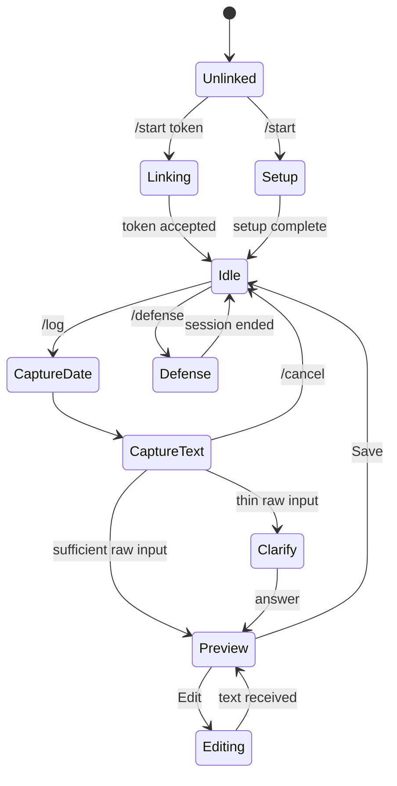

# 07. Telegram bot design

## Purpose

Provide an implementable Telegram adapter with shared data, safe account linking, resumable conversations and feature parity rules.

## Scope

grammY is the adapter. It receives webhook updates, authenticates the bot webhook, maps Telegram identity to the shared user, and calls core services. It never writes domain tables directly.

## Decisions

- Use grammY with webhook in staging/production and long polling only for local development.
- Store conversation state in `BotConversationState` with a compact JSON payload and one row per linked user/chat.
- Record processed Telegram `update_id` before side effects; duplicate updates return success without repeating work.
- Use Telegram HTML formatting with a single escape helper; do not interpolate raw student text into HTML.
- Use authenticated web deep links for long editing, exports, report building and settings.

## Command reference

| Command | Behavior |
| --- | --- |
| `/start` | Link existing account from token or begin bot setup. |
| `/help` | Show commands and privacy/AI grounding explanation. |
| `/today` | Show today’s entry state and next action. |
| `/log` | Start conversational capture for a chosen/default date. |
| `/week` | Show saved/missing working days and weekly summary link. |
| `/month` | Show month progress and summary link. |
| `/skills` | List skills/tools/projects with a web link for filters. |
| `/evidence` | Add a photo/document/link/note to today or a selected project. |
| `/report` | Show report readiness and web editor link. |
| `/defense` | Start/continue practice if unlocked. |
| `/settings` | Timezone, reminders, working days, account link. |
| `/unlink` | Confirm and unlink this Telegram identity. |
| `/cancel` | Clear the current bot state without deleting saved data. |

## Conversation state machine



## Example transcript

```text
Student: /log
Bot: What date should this entry cover? Today is 21 Sep. [Today] [Choose date]
Student: Today
Bot: What did you do? A rough note is fine.
Student: I watched my supervisor configure the router and wrote down the IP addresses.
Bot: I need one detail to keep this accurate: did you personally test or change anything?
Student: I tested the connection from one workstation.
Bot: AI draft:
     Observed my supervisor configure the office router and recorded the IP addresses.
     I then tested connectivity from one workstation.
     [Save] [Edit] [Regenerate]
Student: Save
Bot: Saved for Wednesday, 21 Sep. [View week] [Add evidence]
```

## Inline keyboard layouts

```text
Preview:       [Save] [Edit]
                [Regenerate] [Discard]
Today:         [Log today] [View entry]
                [Week status] [Web app]
Thin input:    [Answer question] [Save raw note]
Defense:       [Start] [Continue] [End session]
```

Buttons carry signed/opaque callback data such as `entry:save:<entryId>:<version>`. The handler rechecks ownership and current version; callback data is not authorization.

## Linking flows

### Web to Telegram

1. Authenticated web user selects Link Telegram.
2. Server creates 10-minute random token, stores only its SHA-256 hash and user ID.
3. Web shows QR/deep link `t.me/<bot>?start=<token>`.
4. Bot receives `/start token`, checks expiry and unused status.
5. Transaction verifies Telegram identity is not attached elsewhere, consumes token and creates identity.
6. Bot confirms linked account and shows `/today`.

### Telegram to web

1. `/start` without token offers a minimal bot setup wizard: name/email optional, institution, department, dates, organization and working days.
2. The bot creates the same User and Programme through core services.
3. It issues a one-time web handoff token and a short-lived authenticated link to finish profile setup.
4. If email is unavailable, the Telegram identity remains the recovery factor until the student attaches Google/email on the web.

### Unlink and loss

- `/unlink` requires a confirmation button and removes the identity, not the user or entries.
- A lost Telegram account is recovered through web auth; a new link token can replace the old identity.
- One Telegram user ID can be linked to at most one app user. A token cannot be replayed.

## Telegram limits and message handling

- Telegram text messages have a 4096-character limit; the adapter chunks generated text on paragraph boundaries and labels parts `1/3`, `2/3`, `3/3`.
- Incoming long text is accepted as multiple messages only while a capture state is active; concatenate with an explicit separator and cap raw input at 5000 characters.
- Photos/documents are evidence candidates, not automatically interpreted as facts. Store Telegram file IDs, then download through a controlled signed-storage flow with size/type checks.
- Voice notes are optional. If enabled, transcribe into `rawText` with `rawSource=VOICE`, show the transcript for confirmation, and account for transcription cost separately.

## Reminders

- Store user timezone and reminder preference; default Africa/Lagos.
- A scheduled job computes each user's local reminder time and skips quiet hours, opt-out and days without a working date.
- Default reminder is 18:00 local, with a second gentle reminder only when the day is still missing and the user opted in.
- Late-night entries use the programme timezone date at capture time, not the server UTC date.

## Webhook security and reliability

- Set Telegram’s webhook secret token and verify `X-Telegram-Bot-Api-Secret-Token` exactly.
- Reject oversized or malformed bodies before grammY parsing.
- Return quickly after recording the update; queue slow generation.
- If the database is down, return a retryable 5xx so Telegram retries; if the LLM is down, save raw input and explain the retry.
- Rate-limit per Telegram user and chat. Avoid leaking whether another user exists.

## Parity matrix

| Feature | Web | Telegram | Reason |
| --- | --- | --- | --- |
| Daily capture/generate/save | Both | Both | Core loop works in either channel. |
| Quick edit | Both | Both, web handoff for long text | Chat edit is good for short corrections. |
| Streak/today/week status | Both | Both | Low-bandwidth friendly. |
| Evidence photo/document/link | Both | Both | Telegram is convenient for capture; web handles organization. |
| Setup and working-day calendar | Both | Guided subset | Web is clearer for complex setup. |
| Weekly/monthly summaries | Both | Read-only preview + web edit | Long editing is better on web. |
| Final report editing/export | Web | Link to web | Document editor and downloads need web. |
| Presentation editing/export | Web | Link to web | Slides need visual editing. |
| Question practice | Both | Both | Conversation suits practice. |
| Mock defense | Both | Both, optional voice | Telegram is useful for short practice. |
| Account/security settings | Both | Limited | Sensitive actions use web confirmation where possible. |

## Open questions

- Which bot username and deployment hostname will be used?
- Is voice transcription affordable for the first release, or should it remain behind a feature flag?
- Does the first cohort need Telegram group/supervisor features? Current scope is private one-to-one chats only.

## Cross-references

See [03-system-architecture.md](./03-system-architecture.md), [05-api-specification.md](./05-api-specification.md), [08-security-and-privacy.md](./08-security-and-privacy.md), and [12-defense-center-design.md](./12-defense-center-design.md).
