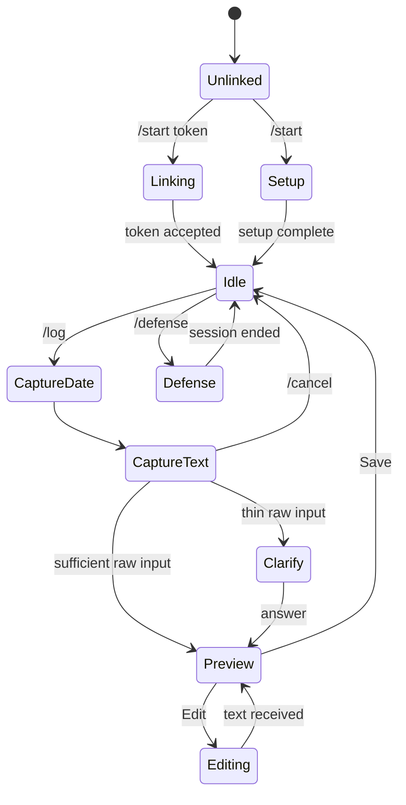

# 07. Telegram bot design

## Purpose

Provide an implementable Telegram adapter with shared data, safe account linking, resumable conversations and feature parity rules.

## Scope

grammY is the adapter. It receives webhook updates, authenticates the bot webhook, maps Telegram identity to the shared user, and calls core services. It never writes domain tables directly.

## Decisions

- Use grammY with webhook in staging/production and long polling only for local development.
- Store conversation state in `BotConversationState` with a compact JSON payload and one row per linked user/chat.
- Record processed Telegram `update_id` before side effects; duplicate updates return success without repeating work.
- Use Telegram HTML formatting with a single escape helper; do not interpolate raw student text into HTML.
- Use authenticated web deep links for long editing, exports, report building and settings.

## Command reference

| Command | Behavior |
| --- | --- |
| `/start` | Link an existing account from a token, otherwise show Home (or the welcome card for a new user). |
| `/help` | Show commands and the grounding promise. |
| `/today` | Show today’s entry card and next action. |
| `/log` | Start capture for today. Free text also becomes today's note, but only while today is empty. |
| `/week` | Saved/draft/missing status for the week's configured working days. |
| `/skills` | Skills and tools extracted from logged entries. |
| `/defense` | Practise panel questions (grounded in saved entries, plus general ones) with a STAR hint. |
| `/web` | One-time sign-in link to the web dashboard (see Telegram to web). |
| `/email` | Add and confirm an email for the account. |
| `/password` | One-time sign-in link that opens the web password page. |
| `/settings` | Placement, dates, working days, timezone, email, password and disconnect. |
| `/unlink` | Confirm and unlink this Telegram identity (blocked if it would lock the student out). |
| `/cancel` | Clear the current bot state without deleting saved data. |
| `/month`, `/evidence`, `/report` | Planned; not implemented yet. |

## Conversation state machine


```mermaid
stateDiagram-v2
  [*] --> Unlinked
  Unlinked --> Setup: /start
  Unlinked --> Linking: /start token
  Linking --> Idle: token accepted
  Setup --> Idle: setup complete
  Idle --> CaptureDate: /log
  CaptureDate --> CaptureText
  CaptureText --> Clarify: thin raw input
  CaptureText --> Preview: sufficient raw input
  Clarify --> Preview: answer
  Preview --> Editing: Edit
  Preview --> Idle: Save
  Editing --> Preview: text received
  Idle --> Defense: /defense
  Defense --> Idle: session ended
  CaptureText --> Idle: /cancel
```

## Example transcript

```text
Student: /log
Bot: What date should this entry cover? Today is 21 Sep. [Today] [Choose date]
Student: Today
Bot: What did you do? A rough note is fine.
Student: I watched my supervisor configure the router and wrote down the IP addresses.
Bot: I need one detail to keep this accurate: did you personally test or change anything?
Student: I tested the connection from one workstation.
Bot: AI draft:
     Observed my supervisor configure the office router and recorded the IP addresses.
     I then tested connectivity from one workstation.
     [Save] [Edit] [Regenerate]
Student: Save
Bot: Saved for Wednesday, 21 Sep. [View week] [Add evidence]
```

## Message style: live cards

Each screen is a *card*: one message whose text and buttons are replaced in place as the flow moves on, rendered by the pure functions in `src/adapters/telegram/views.ts`.

- A button press edits the card it lives on (`Drafting…` → `Draft` → `Saved ✓`), so chats don't fill with stacked replies.
- A typed message always gets a new card below it; the prompt it answered collapses to a one-line summary such as `✓ Institution  Unilag`, and its buttons are removed.
- Every card is a bold title, an optional `· status`, a body, and short plain-text buttons. Emoji are limited to status marks (✓ ○ •).
- All student text is escaped in `views.ts`; card bodies are clipped below Telegram's 4096-character limit with a pointer to the web for the full text.
- The typing indicator appears only while a draft is being generated.

```text
Draft card:    [Save] [Edit] [Redo]
Saved card:    [Edit] [Redo draft] / [This week] [Home]
No draft:      [Try again] [Write it myself] / [Home]
Home:          [Log today] [Today] / [This week] [Skills] / [Practice] [Open web] / [Add email] [Settings]
```

Buttons carry opaque callback data such as `entry:save:<entryId>:<version>` or `nav:<screen>`. The handler rechecks ownership and current version; callback data is not authorization. The legacy `cmd:` prefix is still accepted for buttons in older messages.

## Linking flows

### Web to Telegram

1. Authenticated web user selects Link Telegram.
2. Server creates 10-minute random token, stores only its SHA-256 hash and user ID.
3. Web shows QR/deep link `t.me/<bot>?start=<token>`.
4. Bot receives `/start token`, checks expiry and unused status.
5. Transaction verifies Telegram identity is not attached elsewhere, consumes token and creates identity.
6. Bot confirms linked account and shows `/today`.

### Telegram to web

1. **Set up here** starts a six-step wizard. Step 1 is email (skippable), then institution, course, matric number, placement and duration. A User is created only when the student taps Set up; stray messages from unknown users get the welcome card.
2. Email is asked first so an existing web account is found before a duplicate programme is created:
   - A new address gets a confirmation email. It is written to the user only after the link is confirmed, so nobody can claim someone else's address.
   - An address that already has a web account gets a "Connect Telegram" email instead, naming the requesting Telegram account. Confirming folds the Telegram-only account into the web account (programmes, notifications and usage move over). Because connecting grants that Telegram account sign-in access, a web account that has a password or OAuth login can only be merged while signed in as its owner; the server checks this before consuming the token. If both accounts already have a programme the bot says so up front instead of sending a link.
   - The confirmation page only reads the token; its button POSTs to consume it, so email link scanners cannot confirm on the student's behalf.
   - At most 3 confirmation emails per hour go out per student and per recipient address, so the bot can't be used to flood an inbox.
3. **Open web** (`/web`) issues a one-time sign-in link: 32 random bytes, SHA-256 hash stored in `VerificationToken` (`tg-login:<userId>`), 10-minute expiry. It is consumed by the `telegram-link` Auth.js credentials provider when the `/auth/telegram` page calls `signIn`, not when the page loads, so link previews cannot spend it. Links may only land on an allow-listed page (`/dashboard`, `/settings/password`).
4. **Set a web password** (`/password`) sends the same kind of link, landing on `/settings/password`, where a Telegram-created student can add a password and then sign in with email and password.
5. Until an email is added, the Telegram identity is the only recovery factor. Admins can send every such student an "Add your email" card from the admin Telegram page, and Home keeps an **Add email** button until one is added.

### Unlink and loss

- `/unlink` requires a confirmation button and removes the identity, not the user or entries.
- Unlinking is refused (in the bot and on the web) for an account with no password or OAuth login, because the student would have no way back in. An email alone does not count: there is no email-link sign-in, and Telegram sign-in links stop working once unlinked.
- A lost Telegram account is recovered through web auth; a new link token can replace the old identity.
- One Telegram user ID can be linked to at most one app user. A token cannot be replayed.

## Telegram limits and message handling

- Telegram text messages have a 4096-character limit; the adapter chunks generated text on paragraph boundaries and labels parts `1/3`, `2/3`, `3/3`.
- Incoming long text is accepted as multiple messages only while a capture state is active; concatenate with an explicit separator and cap raw input at 5000 characters.
- Photos/documents are evidence candidates, not automatically interpreted as facts. Store Telegram file IDs, then download through a controlled signed-storage flow with size/type checks.
- Voice notes are optional. If enabled, transcribe into `rawText` with `rawSource=VOICE`, show the transcript for confirmation, and account for transcription cost separately.

## Reminders

- Store user timezone and reminder preference; default Africa/Lagos.
- A scheduled job computes each user's local reminder time and skips quiet hours, opt-out and days without a working date.
- Default reminder is 18:00 local, with a second gentle reminder only when the day is still missing and the user opted in.
- Late-night entries use the programme timezone date at capture time, not the server UTC date.

## Webhook security and reliability

- Set Telegram’s webhook secret token and verify `X-Telegram-Bot-Api-Secret-Token` exactly.
- Reject oversized or malformed bodies before grammY parsing.
- Return quickly after recording the update; queue slow generation.
- If the database is down, return a retryable 5xx so Telegram retries; if the LLM is down, save raw input and explain the retry.
- Rate-limit per Telegram user and chat. Avoid leaking whether another user exists.

## Parity matrix

| Feature | Web | Telegram | Reason |
| --- | --- | --- | --- |
| Daily capture/generate/save | Both | Both | Core loop works in either channel. |
| Quick edit | Both | Both, web handoff for long text | Chat edit is good for short corrections. |
| Streak/today/week status | Both | Both | Low-bandwidth friendly. |
| Evidence photo/document/link | Both | Both | Telegram is convenient for capture; web handles organization. |
| Setup and working-day calendar | Both | Guided subset | Web is clearer for complex setup. |
| Weekly/monthly summaries | Both | Read-only preview + web edit | Long editing is better on web. |
| Final report editing/export | Web | Link to web | Document editor and downloads need web. |
| Presentation editing/export | Web | Link to web | Slides need visual editing. |
| Question practice | Both | Both | Conversation suits practice. |
| Mock defense | Both | Both, optional voice | Telegram is useful for short practice. |
| Account/security settings | Both | Limited | Sensitive actions use web confirmation where possible. |

## Open questions

- Which bot username and deployment hostname will be used?
- Is voice transcription affordable for the first release, or should it remain behind a feature flag?
- Does the first cohort need Telegram group/supervisor features? Current scope is private one-to-one chats only.

## Cross-references

See [03-system-architecture.md](./03-system-architecture.md), [05-api-specification.md](./05-api-specification.md), [08-security-and-privacy.md](./08-security-and-privacy.md), and [12-defense-center-design.md](./12-defense-center-design.md).
