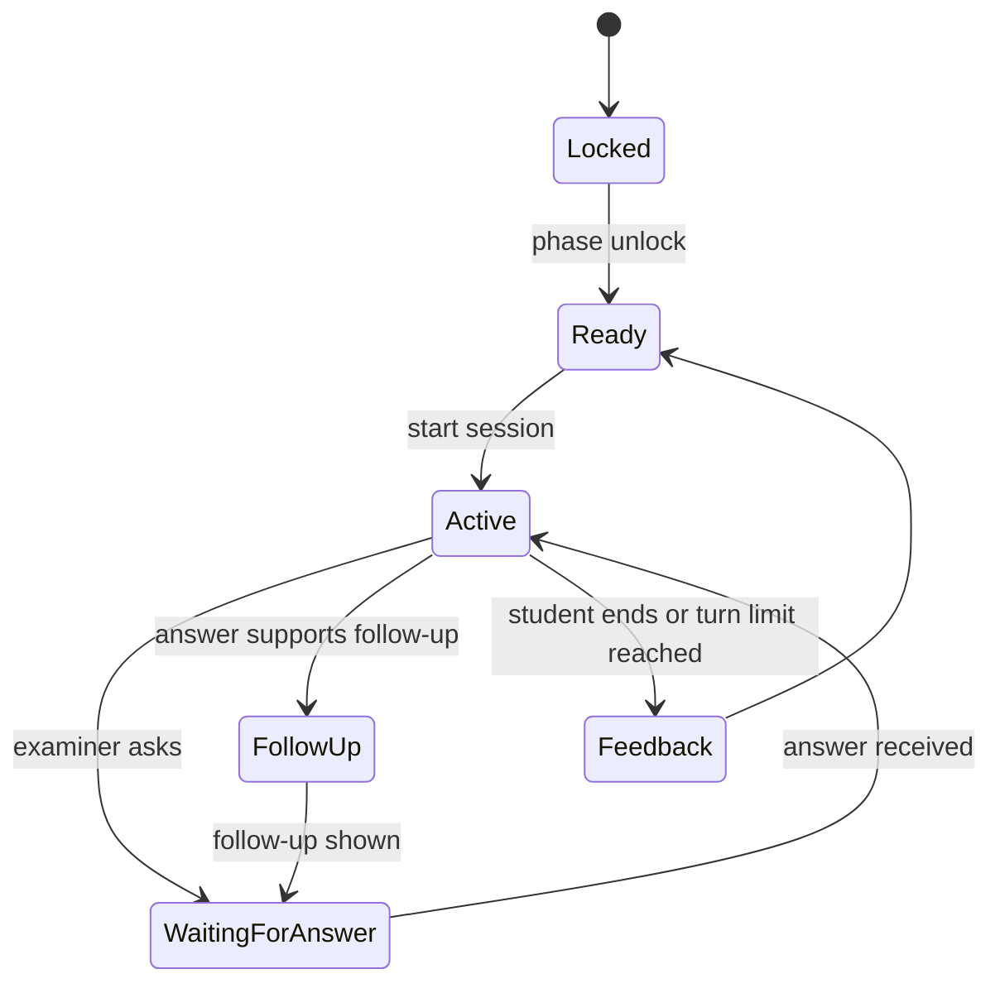

# 12. Defense Center design

## Purpose

Define grounded report, presentation and mock defense preparation that helps students explain their own experience without inventing performance.

## Scope

Defense Center unlocks progressively near the programme end and reuses reviewed entries, summaries, skills, tools, projects and evidence. It is not an academic assessor.

## Progressive unlocks

| Window | Unlock |
| --- | --- |
| Final month | Report organization and section checklist. |
| Final 2 weeks | Presentation outline, slides and speaker notes. |
| Final week | General and personalized question bank. |
| Final 3 days | Mock defense sessions and follow-up practice. |

The actual presentation date should become configurable when the first institutions provide it.

## Report builder

- Shows institution template sections and completion status.
- Generates one section at a time from source IDs.
- Displays source entries beside each section and lets the student edit.
- Flags unsupported gaps for the student to complete manually.
- Keeps prior generated versions for audit but exports only the reviewed version.

## Presentation generator

Default slides: title, organization/unit, activities, tools and skills, project(s), challenges and solutions as documented, learning, conclusion. Each bullet has source IDs and a student-editable text form.

## Mock defense state machine



## Conversation memory

Persist `DefenseSession` and ordered `DefenseTurn` rows. For each call, pass only a compact memory summary, current answer, covered topics and retrieved reviewed records. Never send the entire transcript indefinitely.

## Difficulty

Choose `gentle`, `standard` or `challenging`. Difficulty changes question depth and follow-up count, not factual strictness. A challenging session must still stop rather than infer unsupported material.

## Feedback format

```json
{
  "questionsAnswered": ["..."],
  "topicsCovered": ["..."],
  "areasToReview": ["..."],
  "questionsStruggledWith": ["..."]
}
```

Never display a fabricated “73/100” score. A student can optionally self-rate confidence separately.

## Web and Telegram

- Web: split-pane source context, answer editor, session history and feedback cards.
- Telegram: one question at a time, short text/optional voice transcript, `/defense`, `/end`, and a web link for full feedback.
- Voice, if enabled, is transcribed and shown for confirmation before it becomes an answer.

## Design concerns

Personalized questions are only useful if source retrieval is precise. It is safer to ask a clearly general question than to ask about a project the student never documented.

## Open questions

- What presentation date source should control unlocks: student, institution or both?
- Should voice answers be stored as audio evidence or only as confirmed transcript?

## Cross-references

See [06-ai-llm-design.md](./06-ai-llm-design.md), [07-telegram-bot-design.md](./07-telegram-bot-design.md), and [11-export-and-document-generation.md](./11-export-and-document-generation.md).
